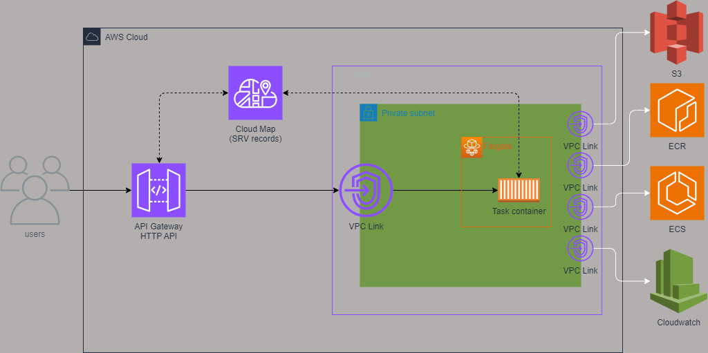

# AWS API ECS

This project uses terraform to launch an http api gateway and connects it to Fargate ecs tasks using Cloud Map service registry

## Architecture

## Create the image and upload it

`docker build -t test-rest-api ./test_rest_server`

`docker run -d -p 5000:5000 test-rest-api`

`aws ecr get-login-password --region us-east-1 | docker login --username AWS --password-stdin XXXXXXXXXX.dkr.ecr.us-east-1.amazonaws.com`

`docker tag test-rest-api:latest XXXXXXXXXX.dkr.ecr.us-east-1.amazonaws.com/test/test-rest-api:latest`

`docker push XXXXXXXXXX.dkr.ecr.us-east-1.amazonaws.com/test/test-rest-api:latest`

*Note:* Remember to replace XXXXXXXXXX with your AWS account id in all commands and files

## Commands

`terraform init`

`terraform plan -var-file=env_dev.tfvars -var-file=env_dev_secrets.tfvars`

`terraform apply -var-file=env_dev.tfvars -var-file=env_dev_secrets.tfvars`

`terraform destroy -var-file=env_dev.tfvars -var-file=env_dev_secrets.tfvars`
